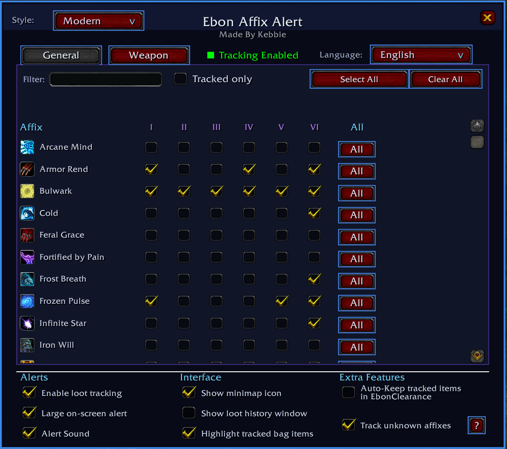

# Ebon Affix Alert (**EAA**)

> A World of Warcraft 3.3.5a addon for Project Ebonhold that watches newly acquired gear for selected Ebonhold affixes and alerts you when something you care about drops.

**Ebon Affix Alert** is an addon for **Project Ebonhold** that watches newly acquired gear for selected Ebonhold affixes and alerts you when something you care about drops.

**EAA** is designed to make affix farming easier without requiring you to inspect every item manually. You choose the General affix ranks and Weapon affixes you want to track, and **EAA** handles the rest.

<p align="center">
  
</p>

<p align="center"><em>Ebon Affix Alert — main interface</em></p>

## Contents

- [Requirements](#requirements)
- [Installation](#installation)
- [Quick Start](#quick-start)
- [Features](#features)
- [Support and Diagnostics](#support-and-diagnostics)
- [Troubleshooting](#troubleshooting)
- [Project / License](#project--license)

## Requirements

- World of Warcraft 3.3.5a client
- Project Ebonhold client with ExtractionService support

## Installation

1. Extract the **EbonAffixAlert** folder into your WoW AddOns directory:

```text
World of Warcraft\Interface\AddOns
```

2. Start the client, or restart it if already running.
3. Make sure **Ebon Affix Alert** is enabled in the AddOns list at character selection.
4. Log into **Project Ebonhold**.
5. Use `/eaa` or the minimap icon to open the main settings window.

## Quick Start

1. Type `/eaa`.
2. On the **General** page, tick the ranks you want **EAA** to watch.
3. On the **Weapon** page, tick the Weapon affixes you want to watch.
4. Leave **Enable loot tracking** enabled.
5. Optionally enable bag highlighting, **Loot History**, and **Unknown Affix Mode**.
6. Loot gear normally. **EAA** will alert only when a newly acquired item matches one of your tracked selections.

## Features

### Affix tracking

- Separate **General** and **Weapon** affix pages.
- General affixes can be tracked rank-by-rank.
- Each General row has an **All** control for selecting or clearing every available rank for that affix.
- Clicking a Roman numeral rank header selects or clears that rank for every visible affix on the page.
- **Select All** selects every option on the currently displayed page.
- **Clear All** clears all tracked affixes.
- Search/filter box for quickly finding an affix.
- **Tracked only** filter for showing only your currently tracked affixes.

### Unknown Affix Mode

- Optional **Track unknown affixes** mode automatically tracks General affix ranks and Weapon affixes that are not present in Project Ebonhold's learned-affix data.
- Manual tracked selections remain independent, so you can still manually track already-learned affixes at the same time.
- A help button beside **Track unknown affixes** opens a copyable list of the currently unknown General ranks and Weapon affixes.
- Hovering the checkbox shows a short explanation of what the feature does.

### Loot detection

**EAA** detects when you loot an item with a tracked affix and alerts you. Safeguards are included to reduce duplicate or false alerts.

### Alerts

- Optional large on-screen alert.
- Optional alert sound.
- General-affix alerts use the raid warning sound with a short anti-spam cooldown.
- Weapon-affix alerts use a distinct sound so they are immediately recognisable.
- `/eaa alert` and `/eaa wepAlert` provide end-to-end test alerts using your current alert settings.

### Bag highlighting

Tracked items can be highlighted directly in your bags with a rarity-coloured glow.

- Uses rarity-colour styling: uncommon = green, rare = blue, epic = purple, legendary = orange.
- Supports the default Blizzard bags.
- Also supports **Bagnon 2.13.3**, **AdiBags**, and **OneBag3**.
- Highlighting is event-driven with no continuous bag scanning.

### EbonClearance integration

When enabled, **EAA** can automatically protect tracked items in **EbonClearance**.

- Items in the player's bags with an affix currently tracked by **EAA** are automatically added to EbonClearance's **Keep List**.
- EAA-managed Keep entries are removed when they are no longer needed by the current tracked-affix selection.
- Existing manual or EbonClearance-managed Keep entries are left untouched.
- A hover tooltip explains how the feature works and notes the item-ID limitation.

### Project Ebonhold integration

Where available, **EAA** uses **Project Ebonhold**'s `ExtractionService.learnedAffixes` data to obtain:

- canonical affix names
- affix spell IDs
- affix icons
- `weaponOnly` information
- currently published General-affix ranks
- learned vs unknown affix status for Unknown Affix Mode

### Affix tooltips

Hovering over affixes in the settings window shows the spell tooltip.

- Hover the icon/name of a General affix for an affix tooltip.
- Hover an individual General rank checkbox for that specific rank's spell tooltip.
- Hover a Weapon affix icon/name for its spell tooltip.

### Loot History

**Loot History** is an optional, movable and resizable window containing only items that actually triggered an **EAA** alert.

- Session-only by design; history is not permanently stored between logins.
- Stores up to 50 entries.
- Newest entries appear first.
- Displays the looted item, tracked affix, and affix icon.
- Shift-click an entry to place its item link into chat.
- Right-click an entry to remove only that history entry.
- Hover an item entry for its normal item tooltip.
- Clear button removes the current session history.
- Optional Transparency mode makes only the **Loot History** background translucent while retaining readable text and controls.

### UI styles and localization

**EAA** includes two UI styles selectable from the top-left of the main window:

#### Modern

A clean black/navy interface with blue accents and a compact modern layout.

#### Fantasy

A more Warcraft-inspired presentation with ornamental corners, an ornate title treatment, fantasy-styled buttons, rune-style checkboxes, ledger row treatments, and a warmer fantasy colour palette.

Additional interface options:

- Built-in language selector for **English**, **French**, **German**, and **Spanish**.
- Language selection changes EAA's own interface/help text only.
- Affix names, item names, and game-provided text remain unchanged.
- The selected style and language are saved.

### Update checking

**EAA** includes a lightweight realm-side update checker.

- Runs automatically on login.
- Can be triggered manually with `/eaa update`.
- Also available from **Interface → AddOns → EbonAffixAlert**.
- Compares the installed addon version and the officially advertised release version.

### Minimap button

The minimap icon provides quick access to **EAA**:

- Left-click: open/close **EAA** settings.
- Right-click: toggle loot tracking.
- Ctrl + left-drag: move the minimap icon.
- Shift + left-click: hide the minimap icon.

The minimap tooltip also shows the current **Loot History** count. The icon can be restored from the main **EAA** settings window.

### Interface Options integration

```text
Interface -> AddOns -> EbonAffixAlert
```

This page provides:

- Master enable checkbox.
- Quick command buttons.
- Export tracked configuration support tool.
- Bug report support tool.
- Diagnostics and troubleshooting controls.
- Manual update-check button.

## Support and Diagnostics

### Export Tracked Configuration

**Export Tracked Config** opens a selectable text window listing the exact General ranks and Weapon affixes you currently track. This is intended primarily for attaching your configuration to a bug report.

### Bug Report

**Bug Report** opens a selectable report containing useful troubleshooting information, including client/build information, **EAA** state, **Project Ebonhold** / ExtractionService state, cache/runtime counts, loaded addons, and your tracked configuration.

Use **Ctrl+A** then **Ctrl+C** to copy the report.

### Status

`/eaa status` prints a one-time health summary including tracking state, tracked-selection count, **Loot History**, active alerts, ExtractionService availability, server catalogue count, cached icons, and relevant diagnostic CVars.

### Update checker

- `/eaa update` manually checks the realm for a newer **EAA** version.
- `/eaa updateDebug` toggles verbose update-check diagnostics in chat.

### Unknown Affix diagnostics

`/eaa unknowntrack` toggles temporary debug output showing which affixes are being automatically tracked by **Unknown Affix Mode**.

### Icon rescan

`/eaa rescanIcons` asks **Project Ebonhold** for the current learned-affix catalogue again and refreshes **EAA**'s affix/icon cache.

### Clear cache

`/eaa clearCache` clears **EAA**'s disposable runtime/persisted icon data and the short-lived duplicate-alert cache, then automatically requests a fresh Ebonhold icon scan.

It intentionally preserves tracked selections, settings, **Loot History**, and the bag ownership baseline.

### Performance monitor

`/eaa perf` toggles a periodic **EAA** performance report in chat. It reports **EAA** memory usage and cache/runtime sizes using WoW's exposed addon APIs.

CPU usage is available only when WoW's script profiling is enabled. To enable it:

```text
/console scriptProfile 1
/reload
```

### Script errors

`/eaa scriptErrors` toggles WoW's `scriptErrors` CVar. This is useful when reproducing a normal Lua error.

For protected-action / taint problems, WoW's taint log can also be enabled manually:

```text
/console taintLog 2
/reload
```

After reproducing the problem, inspect:

```text
World of Warcraft\Logs	aint.log
```

### Debug

`/eaa debug` enables additional **EAA** event/loot diagnostics in chat. Leave this disabled during normal play unless troubleshooting a problem.

## Troubleshooting

### Addon does not appear

- Confirm `EbonAffixAlert.toc` is directly inside `Interface\AddOns\EbonAffixAlert`.
- Confirm the addon is enabled on the character-selection AddOns screen.
- Confirm you are using a compatible 3.3.5a **Project Ebonhold** client.

### No affix icons / tooltips

Project Ebonhold's learned-affix catalogue may not have arrived yet. Try:

```text
/eaa rescanIcons
```

If needed, use:

```text
/eaa status
```

and check whether ExtractionService and learned-affix entries are available.

### Unknown Affix Mode shows nothing

If **Unknown Affix Mode** appears empty when it should not be, use:

```text
/eaa unknowntrack
```

Then toggle the feature and review the resulting debug output together with `/eaa status`.

### Unexpected loot alerts

Enable:

```text
/eaa debug
```

Then reproduce the issue and include the relevant **EAA** chat output plus a Bug Report.

### Lua error popup

Use:

```text
/eaa scriptErrors
```

or:

```text
/console scriptErrors 1
/reload
```

Then reproduce the problem and copy the complete error and stack trace.

### "Interface action failed because of an AddOn"

This is usually a protected-action / taint issue rather than a normal Lua exception. Enable:

```text
/console taintLog 2
/reload
```

Reproduce the problem, then provide `Logs	aint.log` along with an **EAA** Bug Report.

## Project / License

**Ebon Affix Alert** is an independent addon intended for use with **Project Ebonhold**. **Project Ebonhold** and World of Warcraft are separate projects/products and are not distributed with **EAA**.

**Ebon Affix Alert** is open source and distributed under the MIT License. See `LICENSE.txt` for the full license text.

The MIT License permits use, copying, modification, merging, publishing, distribution, sublicensing, and/or sale of copies of the software, subject to retaining the copyright and license notice.

See `CHANGELOG.txt` for version-specific changes.
